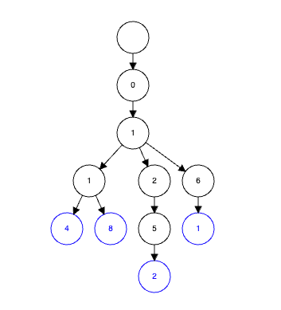

# Advanced Programming Part A

*Algorithms*
---
## Selection Sort

DESCRIPTON

Selection sort works by finding the smallest number in a whole array, then placing it in a fixed (sorted) position at the front of the array. It will then continue through the (unsorted) array to find the next smallest number, and will then place it in the next available (sorted) slot. This will continue until there are no numbers left to move.

In the worst case scenario this algorithm has an O(n2) time complexity, which though isn't the least efficient in terms of big O notation, is not particularly good.

PROS
- **Simple** - easy to understand and not overly complicated in its execution
- **Memory Efficient** - uses a constant amount of memory to execute every time
- **Efficient for small data sets** - a good option for smaller sets of data where more complicated algorithms would be overkill.

CONS
- **Inefficient for large data sets** - due to the time complexity selection sort takes longer, the larger the data set.
- **Sorts everything** - regardless of whether some or much of the data is sorted it will take the same time as if all data were unsorted as it will go through and check every single number.
- **Unsuitable for some situations** - since selection sort relies on swaps it will only really work with arrays and will not work for other types of data structures.

EXAMPLES OF REAL WORLD USAGE
- Organising a list of items by price on a shopping website.
- Sorting a deck of cards.
- Organising files by date created.

IN CODE

*Javascript*
- The code below works by essentially splitting the original array into two sub arrays, a sorted and an unsorted, and iterates through each until the sort is complete.
- Initially a function, 'selectionSort' is declared which takes the parameter 'arr', short for 'array' in this context. (1)
- Then we have a for loop which iterates through each element of the *main* array. (2)
- `min` (minimum number) is declared as `i` (index) to track the index of the minimum unsorted number in the array. (3)
- A second, nested for loop is declared where we have the sub array of unsorted numbers (4)
- Within this we have two 'if statements'.
    - The first says that if the `min` (index) number being checked is greater than the number at the current index of the sub array (`j`) then make instead `min` the value of `j` (5-7)
    - The second 'if statement' then says that if the current `i` is not equal to the value of `min` then we need to swap the two numbers, which will put them in the correct order. (9-13)
- Each loop repeats until the sorted array is returned (15).
- Lines 18 and 20 declare an unsorted array and print to demonstrate that the 'selectionSort' function works as expected.

````
function selectionSort(arr) {
    for (let i = 0; i < arr.length; i++) {
        let min = i;
        for (let j = i + 1; j < arr.length; j++) {
            if (arr[min] > arr[j]) {
                min = j;
            }
        }
            if (i !== min) {
                let temp = arr[i];
                arr[i] = arr[min];
                arr[min] = temp;
        }
    }
    return arr;
}

let arr = [3, 55, 7, 10, 6, 8, 12, 16, 42];

console.log(selectionSort(arr));
````

*Kotlin*
- The logic of the Kotlin code works in very much the same way as the Javascript implementation, with a few syntax and language specific changes.  
  Noticeable differences include:
- Declaration of expected array type within parameters: `IntArray` - which signals the fact that we expect an array containing integers.
- Use of the `indices` property.   This can be used with arrays and lists to acquire the indices range.  It is still essentially executing the same logic as line 3 in the JS code.
- `Until` keyword - used in Kotlin to express a range, from a specific number up to, but not including a specified value.  So in the case of line 5, index + 1 up to but not including the size (same as `length` property in javascript) of the array.
- Wrapping of actual code execution in `main` - a convention specific to the language, much like Java.  The `main` function is essential to any Kotlin program as it defines the entry point for executing the code.

````
fun selectionSort(arr: IntArray): IntArray {
    for (i in arr.indices) {
        var min = i
        for (j in i + 1 until arr.size) {
            if (arr[min] > arr[j]) {
                min = j
            }
        }
        if (i != min) {
            val temp = arr[i]
            arr[i] = arr[min]
            arr[min] = temp
        }
    }
    return arr
}

fun main() {
    val arr = intArrayOf(3, 55, 7, 10, 6, 8, 12, 16, 42)
    println(selectionSort(arr).contentToString()) 
}
````
The output of the above code:

[
   3,  6,  7,  8, 10,
  12, 16, 42, 55
]


## Radix Sort

DESCRIPTON

Radix Sort uses the size of an element to organise a list or array of items, rather than swapping them like the selection sort algorithm.  It is particularly effective on numbers of large sizes as it sorts the values of elements in order by the biggest to smallest value.  Can only be used on integers but can be used on strings also.

It works by sorting each digit position into buckets, then sorting each digit within the bucket by looking at the next digit position, once they are sorted it will then merge all the buckets.

PROS
- **Efficient for large data sets** - in comparison to some other algorithms as it doesn't compare every item.
- **Good for integers** - created specifically with integers in mind.
- **Can sort data of varying lengths**

CONS
- **Not memory efficient** - as each bucket requires additional storage.
- **Not suitable for all data types or scenarios**

EXAMPLES OF REAL WORLD USAGE:
- Sorting phone numbers.
- Sorting IP addresses.
- Sorting by customer reference number.

IN CODE:

*Javascript:*
- First an unsorted array containing a varied selection of integers is declared to be sorted. (1)
- On the next line `getDigit` calculates the digit at position `i` (2)
- `numberCount` calculates the number of digits within the value `num`.  (4-7)
  e.g. if num = 31415 it would return 5,
  if num = 629 it would return 3 etc.
- `mostNumbers` iterates through the array and calculates the maximum number of digits out of all the numbers within.  In this example this would be five.  (9-15)
- `radixSort` is the main function which executes the algorithm. (17-32)
    - First it uses `mostNumbers` to calculate the maximum number of digits.
    - It then creates 10 'buckets' and sorts the numbers into these.
    - It then concatenates the sorted numbers back into a single sorted array.


````
const arr = [303,2923,176,412,609,588,767,9,823,10, 672, 686, 90, 16, 53840, 234, 565]
const getDigit = (num, i) => Math.floor(Math.abs(num) / Math.pow(10, i)) % 10

const numberCount = num => {
    if (num === 0) return 1
    return Math.floor(Math.log10(Math.abs(num))) + 1
}

const mostNumbers = nums => {
    let maxNumbers = 0
    for (let i = 0; i < nums.length; i++) maxNumbers = Math.max(maxNumbers, numberCount(nums[i]))
    return maxNumbers
}

const radixSort = nums => {
    let maxNumberCount = mostNumbers(nums)
    for (let a = 0; a < maxNumberCount; a++) {
        let numberBuckets = Array.from({ length: 10 }, () => [])
        for (let i = 0; i < nums.length; i++) {
            let number = getDigit(nums[i], a)
            numberBuckets[number].push(nums[i])
        }
        nums = [].concat(...numberBuckets)
    }
    return nums
}

console.log(radixSort(arr))
````

*Kotlin:*
- The first noticeable difference in Kotlin is the fact that we have to import some functions from the Kotlin math library.
    - This is a standard feature of Kotlin where only the functions which are imported into the project are available to be used.
    - The reasoning behind this is to reduce the amount of resources that the complier needs to do in processing the code and so increases overall efficiency and processing time.  It also allows for better readability and eliminates the danger of naming conflicts, which are more likely to occur in Javascript.
    - In many IDE's such as IntelliJ, the required imports are retrieved automatically by the IDE so it doesn't actually require the developer to write additional code.
- Where the functions share a name with the Javascript code the execution, and even the code itself is almost identical with the differences being largely syntactical in a few locations.
- As we have seen previously, the declaration of the `list` (synonymous with array in JS), calling of the sort function and print statement are wrapped in a `main` function.

````
import kotlin.math.abs
import kotlin.math.floor
import kotlin.math.log10
import kotlin.math.pow

fun getDigit(num: Int, i: Int): Int {
    return (floor(abs(num.toDouble()) / 10.0.pow(i.toDouble())) % 10).toInt()
}

fun numberCount(num: Int): Int {
    if (num == 0) return 1
    return (floor(log10(abs(num.toDouble()))) + 1).toInt()
}

fun mostNumbers(nums: List<Int>): Int {
    var maxNumbers = 0
    for (num in nums) {
        maxNumbers = maxOf(maxNumbers, numberCount(num))
    }
    return maxNumbers
}

fun radixSort(nums: MutableList<Int>): List<Int> {
    var numbers = nums.toList()
    val maxNumberCount = mostNumbers(numbers)

    for (a in 0 until maxNumberCount) {
        val numberBuckets = List(10) { mutableListOf<Int>() }
        for (i in numbers.indices) {
            val num = getDigit(numbers[i], a)
            numberBuckets[num].add(numbers[i])
        }
        numbers = numberBuckets.flatten()
    }
    return numbers
}

fun main() {
    val arr = listOf(303, 2923, 176, 412, 609, 588, 767, 9, 823, 10, 672, 686, 90, 16, 53840, 234, 565)
    val sortedArr = radixSort(arr.toMutableList())
    println(sortedArr)
}

````
The output of the above code:

[
      9,  10,  16,   90,
    176, 234, 303,  412,
    565, 588, 609,  672,
    686, 767, 823, 2923,
  53840
]


*Data Structures*
---
## Tries

DESCRIPTON

Tries, short for 'retrieval', are tree based data structures which store and retrieve keys in specifically string based data sets.  Sometimes called a 'prefix tree', tries are ordered alphabetically and may have a maximum of 26 'children', one for each letter of the alphabet.
Common usage of tries include autocomplete and spell checkers.  The root node in a trie is always blank.

PROS
- **Sorted** - automatically ordered.
- **Support ordered iteration.**
- **Deletion of items is easy.**
- **Time complexity** - O(n) - efficient, will increase in time by the length of the word.

CONS
- **Memory heavy** - it takes up quite a lot of space to store all the different words
- **Inefficiency** - other options such as hash tables, can sort similar types of data more efficiently
- **Complexity** - not the most simple structure to work with and requires plenty of planning and testing to implement.

EXAMPLES OF REAL WORLD USAGE:
- Autocorrect in documents.
- Auto suggestions in search engines.
- DNA sequence matching.

IN CODE



The above image is a representation of the trie executed in the code below.


*Javascript*

- This code uses an OOP format to demonstrate a trie structure that validates UK phone number area codes and then displays the associated area name.
- First the `TrieNode` class is created which contains the elements:
    - `children` where a map is needed since each node needs to be represented along with the actual value within the node.
    - `isEndOfAreaCode` - if a full area code is detected this will return true and so we will know that it is a valid area code.
    - `location` - if the area code is validated then the applicable area can be returned.
- Then the `PhoneTrie` class is declared which contains the empty root and two methods:
    - `areaCode` which inserts an area code and location into the trie as well as noting which node contains the last number of the area code so that it can be validated.
    - `isValid` iterates through the trie to check if the area code is within it, breaking out if a number isn't found within or if it finds a character that is not a number.  
      Note: an issue with this code is the fact that it will only check the prefix for valid characters.  If a character is entered in the section after the prefix it will return as valid.
- If the prefix of the phone number passed through is deemed to have a valid area code then the location will be returned as the corresponding area.  If it is not found or is invalid then `null` will be returned.
- There are some examples of real area codes and demonstration of a selection of valid and invalid phone numbers.

````
class TrieNode {
    constructor() {
        this.children = new Map();
        this.isEndOfAreaCode = false;
        this.location = null;
    }
}

class PhoneTrie {
    constructor() {
        this.root = new TrieNode();
    }

    areaCode(areaCode, location) {
        let node = this.root;
        for (const char of areaCode) {
            if (!node.children.has(char)) {
                node.children.set(char, new TrieNode());
            }
            node = node.children.get(char);
        }
        node.isEndOfAreaCode = true;
        node.location = location;
    }

    isValid(phoneNumber) {
        let node = this.root;
        let detectedLocation = null;

        for (const char of phoneNumber) {
            if (isNaN(parseInt(char))) {
                break;
            }

            if (!node.children.has(char)) {
                return detectedLocation;
            }

            node = node.children.get(char);
            if (node.isEndOfAreaCode) {
                detectedLocation = node.location;
            }
        }

        return detectedLocation;
    }
}


    const phoneTrie = new PhoneTrie();

    phoneTrie.areaCode("0114", "Sheffield");
    phoneTrie.areaCode("0118", "Reading");
    phoneTrie.areaCode("0161", "Manchester");
    phoneTrie.areaCode("01252", "Aldershot");

    console.log(phoneTrie.isValid("011412345678"));
    console.log(phoneTrie.isValid("01189328532"));
    console.log(phoneTrie.isValid("01614567890"));
    console.log(phoneTrie.isValid("01252545197"));
    console.log(phoneTrie.isValid("012369567899"));
    console.log(phoneTrie.isValid("fhjv369567899"));

````

*Kotlin*

- The execution of the code is very similar in Kotlin, though it is a little more concise due to the fact that Kotlin is better constructed to deal with OOP code and has some syntactical differences:
    - Kotlin uses `val` and `var` which are the equivalent of `const` and `let` respectively in javascript.
    - Kotlin requires data type declaration.
    - `mutableMapOf` needs to be used.  There is also the `MapOf` function but it is by default immutable.
    - Kotlin's `getOrPut` function allows the for loop within the areaCode function to be more concise.
    - Within the `isValid` function the ``!char.isDigit()``in Kotlin essentially works the same way as the `isNaN` in JS.

````
import kotlin.math.abs
import kotlin.math.floor
import kotlin.math.log10
import kotlin.math.pow

fun getDigit(num: Int, i: Int): Int {
    return (floor(abs(num.toDouble()) / 10.0.pow(i.toDouble())) % 10).toInt()
}

fun numberCount(num: Int): Int {
    if (num == 0) return 1
    return (floor(log10(abs(num.toDouble()))) + 1).toInt()
}

fun mostNumbers(nums: List<Int>): Int {
    var maxNumbers = 0
    for (num in nums) {
        maxNumbers = maxOf(maxNumbers, numberCount(num))
    }
    return maxNumbers
}

fun radixSort(nums: MutableList<Int>): List<Int> {
    var numbers = nums.toList()
    val maxNumberCount = mostNumbers(numbers)

    for (a in 0 until maxNumberCount) {
        val numberBuckets = List(10) { mutableListOf<Int>() }
        for (i in numbers.indices) {
            val num = getDigit(numbers[i], a)
            numberBuckets[num].add(numbers[i])
        }
        numbers = numberBuckets.flatten()
    }
    return numbers
}

fun main() {
    val arr = listOf(303, 2923, 176, 412, 609, 588, 767, 9, 823, 10, 672, 686, 90, 16, 53840, 234, 565)
    val sortedArr = radixSort(arr.toMutableList())
    println(sortedArr)
}

````
The output of the above code:

Sheffield  
Reading  
Manchester  
Aldershot  
null  
null  


----
*Design Patterns*
---

## Decorator

DESCRIPTON

A decorator is a **structural** type pattern where a particular behaviour is able to be added to one object within a class without changing any other objects within the same class.

PROS
- **Flexible** - can be added and/ or removed whilst a program is running.  This also follows the 'O' in the OOP 'SOLID' principal 'Open/ Closed'.  This dictates that software should be open only to extension but not modification.
- **Reusability of code** - decorators use existing code and can be combined with one another to modify behaviours.
- **Code Readability & Maintainability** - decorators follow the same rules as the original object which makes their behaviour easy to understand and to extend.

CONS
- **Complexity** - not especially intuitive where there are lots of decorators there may be confusion with regards to behaviours and the order of execution of each decorator.  Where this is the case it may be worth considering whether it would be more appropriate to use an alternative approach.
- **Inefficient** - where there are lots of decorators, the memory required to process the code may be high.
- **Not supported in all languages** - Python, Java and some other languages do not natively support decorators, which would mean extra code to implement.  This could negate the benefit of using them in some languages.

EXAMPLES OF REAL WORLD USAGE
- Authentication and authorisation - e.g. checking if a user is logged in and has permissions to view a particular page or perform an action.
- Database connection handling - to open and close connections smoothly.
- API rate limiting - to limit requests from clients to ensure resources are used fairly and not abused.

IN CODE

*Javascript:*
- For this decorator design pattern an OOP approach is used.
- Initially the base class `VeryHungryCatepillar` is defined with one method that returns specific text which will be the prefix for the decorators.
- `BasicCaterpillar` class is then declared as an empty class which simply inherits the base class functionality so that it is available to be executed alone.
- Then a few decorator classes are declared each with their own behaviour, in this case the execution of a specific string.
- Following this, instances of each decorator are created, including one to demonstrate how decorators can be used together.

````
class VeryHungryCaterpillar {
    eat() {
        return "The Very Hungry Caterpillar is eating";
    }
}

class BasicCaterpillar extends VeryHungryCaterpillar {}

class PearDecorator extends BasicCaterpillar {
    constructor(caterpillar) {
        super();
        this.caterpillar = caterpillar;
    }

    eat() {
        return `${this.caterpillar.eat()}  one pear.`;
    }
}

class AppleDecorator extends BasicCaterpillar {
    constructor(caterpillar) {
        super();
        this.caterpillar = caterpillar;
    }

    eat() {
        return `${this.caterpillar.eat()} two apples.`;
    }
}

class BananaDecorator extends BasicCaterpillar {
    constructor(caterpillar) {
        super();
        this.caterpillar = caterpillar;
    }

    eat() {
        return `${this.caterpillar.eat()} three bananas.`;
    }
}

const basicCaterpillar = new BasicCaterpillar();
const pearCaterpillar = new PearDecorator(basicCaterpillar);
const appleCaterpillar = new AppleDecorator(basicCaterpillar);
const bananaCaterpillar = new BananaDecorator(basicCaterpillar);
const bananaAndAppleCaterpillar = new BananaDecorator(new AppleDecorator(basicCaterpillar));

console.log(basicCaterpillar.eat());
console.log(pearCaterpillar.eat());
console.log(appleCaterpillar.eat());
console.log(bananaCaterpillar.eat());
console.log(bananaAndAppleCaterpillar.eat());

````

*Kotlin:*
- The execution in Kotlin is quite similar to JS though again a little more concise and with language specific syntax changes.
- Rather than `extends` Kotlin simply uses `:` to declare inheritance.
- The 'constructor' is also declared slightly differently, with it being declared in the class header and using `private val` which ensures that the properties within the specified class are only used in conjunction with that specific class.

````
interface caterpillar {
    fun eat(): String
}

class BasicCaterpillar : caterpillar {
    override fun eat(): String {
        return "The Very Hungry Caterpillar is eating"
    }
}

class PearDecorator(private val caterpillar: caterpillar) : caterpillar {
    override fun eat(): String {
        return "${caterpillar.eat()} one pear"
    }
}

class AppleDecorator(private val caterpillar: caterpillar) : caterpillar {
    override fun eat(): String {
        return "${caterpillar.eat()} two apples"
    }
}

class BananaDecorator(private val caterpillar: caterpillar) : caterpillar {
    override fun eat(): String {
        return "${caterpillar.eat()} three bananas"
    }
}

fun main () {
    val basicCaterpillar = BasicCaterpillar()
    val pearCaterpillar = PearDecorator(basicCaterpillar)
    val appleCaterpillar = AppleDecorator(basicCaterpillar)
    val bananaCaterpillar = BananaDecorator(basicCaterpillar)
    val bananaAndAppleCaterpillar = BananaDecorator(PearDecorator(basicCaterpillar))

    println(basicCaterpillar.eat())
    println(pearCaterpillar.eat())
    println(appleCaterpillar.eat())
    println(bananaCaterpillar.eat())
    println(bananaAndAppleCaterpillar.eat())
}
````
The output of the above code:

The Very Hungry Caterpillar is eating  
The Very Hungry Caterpillar is eating  one pear.  
The Very Hungry Caterpillar is eating two apples.  
The Very Hungry Caterpillar is eating three bananas.  
The Very Hungry Caterpillar is eating two apples. three bananas.  


## Prototype

DESCRIPTON

A prototype is a **creational** type design pattern which works by creating a template and then cloning that template.

PROS
- **Code Reusability and Maintainability** - code doesn't need to be duplicated so common code is able to be shared between multiple objects.
- **Efficient and not too resource heavy** - due to the fact that the code can be reused.
- **Flexible** - clones can be modified to suit developers needs.

CONS
- **Complexity** - similarly to the issue with the decorator design pattern, projects with many instances of prototypes and clones can be confusing.
- **Unsuitable in some circumstances** - some objects may have logic which is too specific or complex to lend itself to being cloned and so unintended results could occur.  For example, where circular dependencies occur cloning an object may result in infinite loops.
- **Clones must replicate specific behaviours** which may not be appropriate in all circumstances and so may result in ultimately needing to write additional code.

EXAMPLES OF REAL WORLD USAGE
- User profile on a website - a template containing essential details such as name, dob and profile image can be created.  Then this can be cloned and modified to create a unique profile. 
- Enemies in games - a template of dominant attacks, damage amount and basic UI can be created, then developers can modify as appropriate to increase or decrease strength, change apperence and any other characteristics.
- Document templates in a word processor - templates for different types of documents are common place in word processors such as newsletter, article or cv, which can then be edited by the user to their desired specification.

IN CODE

*Javascript:*
- First a cocktail prototype constructor function is declared with the parameters `name` and `ingredients` which returns these parameters and executes the nested function `text`. (1-10)
- The `text` function formats the text output of the cocktail and ingredients. (2-4)
- Then prototypes are created for specific cocktails based on the original cocktail prototype template. (12-14)
- Next the clones are created using the `Object.create()` method, along with some modifications to demonstrate the ways in which clones can be edited. (16-25)
- Finally each of the clones are called along with the pre-formatted text(27-29).

````
function cocktailPrototype(name, ingredients) {
    function text() {
        console.log(`Cocktail: ${this.name}\nIngredients: ${this.ingredients.join(', ')})`)
    }
    return {
        name,
        ingredients,
        text,
    };
}

const frenchMartiniPrototype = cocktailPrototype('French Martini', ['Vodka', 'Chambord', 'Pineapple Juice', 'Licor 75']);
const darkAndStormyPrototype = cocktailPrototype('Dark and Stormy', ['Dark Rum', 'Ginger Beer', 'Lime juice']);
const whiskySourPrototype = cocktailPrototype('Whisky Sour', ['Bourbon', 'Lemon Juice', 'Sugar Syrup']);

const frenchMartini = Object.create(frenchMartiniPrototype);
frenchMartini.name = 'French Martini';
frenchMartini.ingredients.pop();

const darkAndStormy = Object.create(darkAndStormyPrototype);
darkAndStormy.name = 'Dark and Stormy';

const whiskySour = Object.create(whiskySourPrototype);
whiskySour.name = 'Whisky Sour';
whiskySour.ingredients.push('Egg White');

frenchMartini.text();
darkAndStormy.text();
whiskySour.text();

````

*Kotlin:*
- The execution in Kotlin is again quite similar, but with a few language specific differences.
- Kotlin is able to refer straight to the properties of the cocktail prototype by using the class constructor where as javascript required the additional object method.
- Similarly to the case of the `mutableMapOf` in the trie code block, Kotlin requires the declaration that the array is able to be mutable with the use of `mutableListOf` as omitting the 'mutable' would create a default immutable array and so would not allow for the adding and removing of items to the array.

````
class CocktailPrototype(var name: String, var ingredients: MutableList<String>) {
    fun text() {
        println("Cocktail: $name \nIngredients: ${ingredients.joinToString(", ")}")
    }
}

fun main() {
    val frenchMartiniPrototype = CocktailPrototype("French Martini", mutableListOf("Vodka", "Chambord", "Pineapple Juice", "Licor 75"))
    val darkAndStormyPrototype = CocktailPrototype("Dark and Stormy", mutableListOf("Dark Rum", "Lemons", "Ginger Beer", "Bitters"))
    val whiskeySourPrototype = CocktailPrototype("Whiskey Sour", mutableListOf("Bourbon", "Egg White", "Sugar Syrup", "Lemon Juice"))

    val frenchMartini = CocktailPrototype(frenchMartiniPrototype.name, frenchMartiniPrototype.ingredients.toMutableList())
    frenchMartini.ingredients.remove("Licor 75")
    frenchMartini.text()

    val darkAndStormy = CocktailPrototype(darkAndStormyPrototype.name, darkAndStormyPrototype.ingredients.toMutableList())
    darkAndStormy.ingredients.add("Lime Wedge")
    darkAndStormy.ingredients.remove("Lemons")
    darkAndStormy.text()

    val whiskeySour = CocktailPrototype(whiskeySourPrototype.name, whiskeySourPrototype.ingredients.toMutableList())
    whiskeySour.text()
}

````
The output of the above code:

Cocktail: French Martini  
Ingredients: Vodka, Chambord, Pineapple Juice)  
Cocktail: Dark and Stormy  
Ingredients: Dark Rum, Ginger Beer, Lime juice)  
Cocktail: Whisky Sour  
Ingredients: Bourbon, Lemon Juice, Sugar Syrup, Egg White)  

## State

DESCRIPTON

A state is a **behavioural** type design pattern which allows an object to change behaviour when its internal state changes, as if it has changed class but in fact without changing its class.  It is a better alternative to the use of multiple if/ else statements.

PROS
- **Readability** - since each state is organised into separate classes it is easy to read the code and understand the behaviour of each state.
- **Flexibility** - very easy to add new states as it follows the Open/Closed principal.
- **Testing** - follows the separation of concerns principal and makes it easy to test each state.

CONS
- **Complexity**  in situations where there are many states, it could make the code very lengthy and confusing with all the additional classes.
- **Unsuitable in some situations** - where only a small number of states are required using this design pattern may be overkill, using unnecessary extra resources and using if/else statements could be preferable.
- **State transition** may require extra management if they rely on external factors.  Additional situations need to be considered to ensure crashes or bugs are not introduced where other objects or input interact with each state class.

EXAMPLES OF REAL WORLD USAGE
- Traffic lights - Green, Amber, Red.  
- Video players - Start, Stop, Forward, Rewind.  
- Mobile application states - Active, Paused, Stopped, Destroyed  

IN CODE

*Javascript:*
- Initially a class is declared with two empty methods for state behaviour. (1-3)
- Then five states are declared as classes each with their own behaviours, mirroring that of the initial base class. (6-54)
- Next the class `Mario` is declared which contains a constructor and a method which formats the text for output to show the state behaviours. (56-64)
- Finally the instances of each state are created and then printed.

````
class MarioState {
    stateBehaviour() {}
    accessorize() {}
}

class BaseMode extends MarioState {
    stateBehaviour() {
        return "It's-a me, Mario!";
    }

    accessorize() {
        return "Blue Overalls";
    }
}

class DriverMode extends MarioState {
    stateBehaviour() {
        return "Ready to race!";
    }

    accessorize() {
        return "Race Car";
    }
}

class DoctorMode extends MarioState {
    stateBehaviour() {
        return "Dr. Mario at your service!";
    }

    accessorize() {
        return "Stethoscope";
    }
}

class TennisMode extends MarioState {
    stateBehaviour() {
        return "Ready to serve!";
    }

    accessorize() {
        return "Tennis Racket";
    }
}

class FightMode extends MarioState {
    stateBehaviour() {
        return "Combat stance activated!";
    }

    accessorize() {
        return "Fire Flower";
    }
}

class Mario {
    constructor(current) {
        this.current = current;
    }

    text() {
        return `${this.current.stateBehaviour()} \n Now equipped with a ${this.current.accessorize()}`;
    }
}

const baseMario = new Mario(new BaseMode());
const raceMario = new Mario(new DriverMode());
const doctorMario = new Mario(new DoctorMode());
const tennisMario = new Mario(new TennisMode());
const fightMario = new Mario(new FightMode());

console.log(baseMario.text());
console.log(raceMario.text());
console.log(doctorMario.text());
console.log(tennisMario.text());
console.log(fightMario.text());

````

*Kotlin:*
- Side by side the Kotlin is almost identical to the javascript.  There are various syntactical differences and language specific traits which have been explained previously which occur.  
  In addition:
- The Kotlin code uses `interface` instead of class to emphasise which class all of the state classes need to adhere to.
- This example also uses the `override` keyword to override the default behaviours.


````
// Updated State interface
interface MarioState {
    fun stateBehaviour(): String
    fun accessorize(): String
}

class BaseMode : MarioState {
    override fun stateBehaviour(): String {
        return "It's-a me, Mario!"
    }
    override fun accessorize(): String {
        return "Blue Overalls"
    }
}

class DriverMode : MarioState {
    override fun stateBehaviour(): String {
        return "Ready to race!"
    }
    override fun accessorize(): String {
        return "Race Car"
    }
}

class DoctorMode : MarioState {
    override fun stateBehaviour(): String {
        return "Dr. Mario at your service!"
    }
    override fun accessorize(): String {
        return "Stethoscope"
    }
}

class TennisMode : MarioState {
    override fun stateBehaviour(): String {
        return "Ready to serve!"
    }
    override fun accessorize(): String {
        return "Tennis Racket"
    }
}

class FightMode : MarioState {
    override fun stateBehaviour(): String {
        return "Combat stance activated!"
    }
    override fun accessorize(): String {
        return "Fire Flower"
    }
}

class Mario(var current: MarioState) {
    fun text(): String {
        return "${current.stateBehaviour()} \n Now equipped with a ${current.accessorize()}"
    }
}

fun main() {
    val baseMario = Mario(BaseMode())
    val raceMario = Mario(DriverMode())
    val doctorMario = Mario(DoctorMode())
    val tennisMario = Mario(TennisMode())
    val fightMario = Mario(FightMode())

    println(baseMario.text())
    println(raceMario.text())
    println(doctorMario.text())
    println(tennisMario.text())
    println(fightMario.text())
}

````
The output of the above code:

Dr. Mario at your service!   
 Now equipped with a Stethoscope  
Ready to serve!   
 Now equipped with a Tennis Racket  
Combat stance activated!   
 Now equipped with a Fire Flower  


